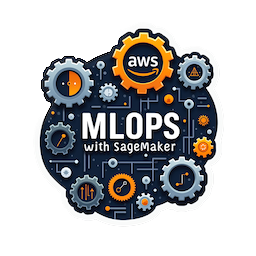
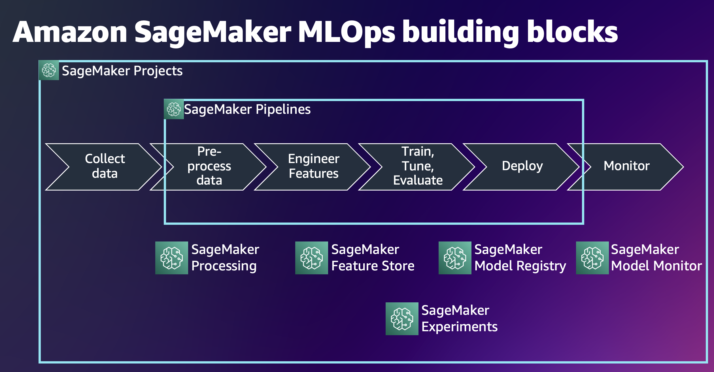
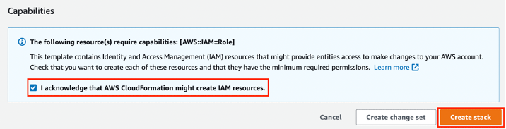
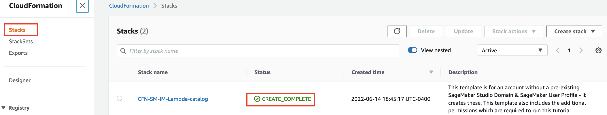
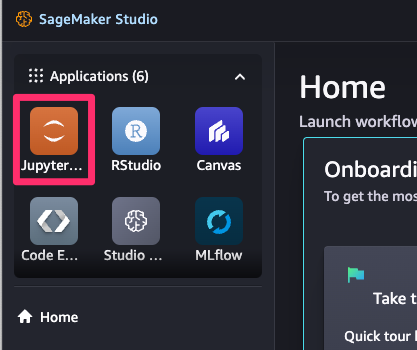
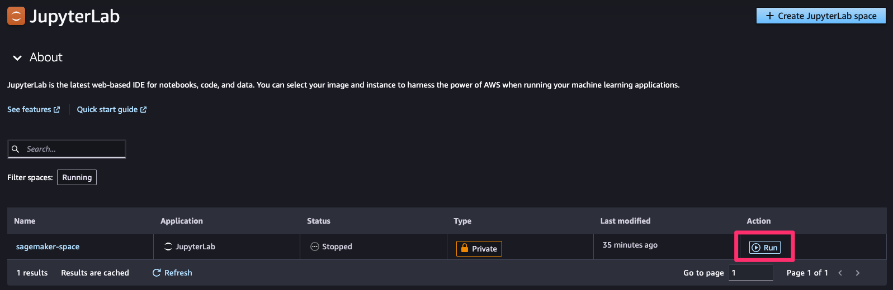
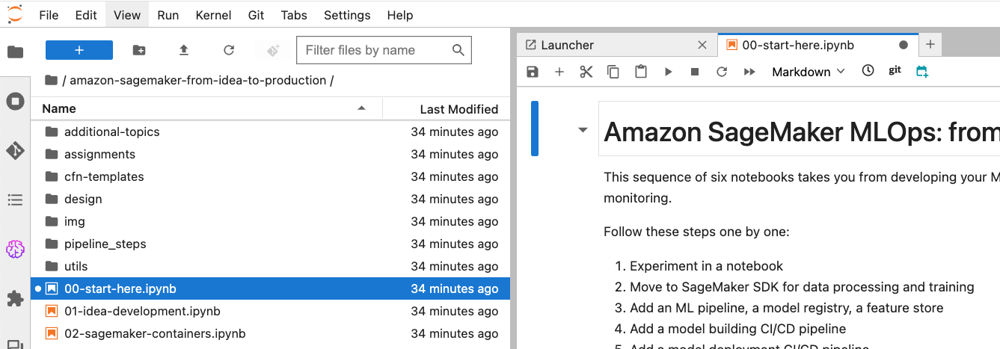
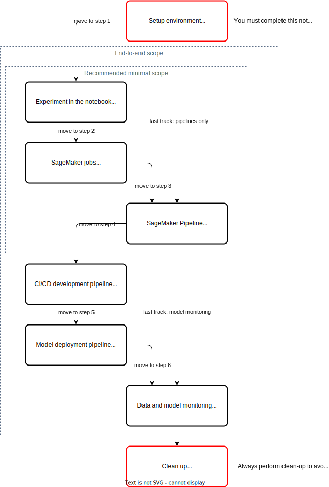

# Amazon SageMaker AI MLOps: 아이디어에서 프로덕션까지 6단계



이 저장소는 [Amazon SageMaker AI](https://aws.amazon.com/sagemaker-ai)를 사용하여 ML 아이디어를 프로덕션으로 전환하는 방법을 보여주는 Jupyter 노트북 시리즈를 포함하고 있습니다.

이 노트북들은 SageMaker AI [처리](https://docs.aws.amazon.com/sagemaker/latest/dg/processing-job.html) 및 [학습](https://docs.aws.amazon.com/sagemaker/latest/dg/train-model.html) 작업과 함께 [SageMaker Pipelines](https://aws.amazon.com/sagemaker/pipelines/), [SageMaker Feature Store](https://aws.amazon.com/sagemaker/feature-store/), [SageMaker Model Registry](https://docs.aws.amazon.com/sagemaker/latest/dg/model-registry.html), [SageMaker managed MLflow experiments](https://docs.aws.amazon.com/sagemaker/latest/dg/mlflow.html), [SageMaker Model Monitor](https://aws.amazon.com/sagemaker/model-monitor/) 등의 SageMaker AI MLOps 기능을 활용합니다.

데이터 전처리, 특성 엔지니어링, 모델 학습을 위한 기본 ML 코드가 포함된 노트북으로 시작하여, 각 후속 노트북은 이전 내용을 기반으로 하나 또는 여러 개의 SageMaker AI MLOps 기능을 소개합니다:



각 노트북은 유용한 실습 자료에 대한 링크를 제공하고 추가 개발을 위한 실제 아이디어를 제안합니다.

6개의 노트북을 통해 ML 아이디어를 실험적 노트북에서 권장되는 MLOps 사례를 따르는 프로덕션 준비 솔루션으로 발전시킵니다:

|단계|내용|노트북|
|---|---|---|
|1. |노트북에서 실험 |[01-idea-development](01-idea-development.ipynb)|
|2. |SageMaker AI 처리 작업과 Python SDK로 확장 |[02-sagemaker-containers](02-sagemaker-containers.ipynb)|
|3. |ML 파이프라인, 모델 레지스트리, 피처 스토어로 운영화 |[03-sagemaker-pipeline](03-sagemaker-pipeline.ipynb)|
|4. |모델 구축 CI/CD 파이프라인 추가 |[04-sagemaker-project](04-sagemaker-project.ipynb)|
|5. |모델 배포 파이프라인 추가 |[05-deploy](05-deploy.ipynb)|
|6. |모델 및 데이터 모니터링 추가 |[06-monitoring](06-monitoring.ipynb)|

## 추가 주제
[A/B 테스트](https://docs.aws.amazon.com/sagemaker/latest/dg/model-validation.html), 커스텀 [처리](https://docs.aws.amazon.com/sagemaker/latest/dg/build-your-own-processing-container.html), [학습](https://docs.aws.amazon.com/sagemaker/latest/dg/your-algorithms-training-algo.html) 및 [추론](https://docs.aws.amazon.com/sagemaker/latest/dg/your-algorithms-inference-main.html) 컨테이너, [디버깅 및 프로파일링](https://docs.aws.amazon.com/sagemaker/latest/dg/train-debugger.html), [보안](https://docs.aws.amazon.com/sagemaker/latest/dg/security.html), [멀티모델](https://docs.aws.amazon.com/sagemaker/latest/dg/multi-model-endpoints.html) 및 [멀티컨테이너](https://docs.aws.amazon.com/sagemaker/latest/dg/multi-container-endpoints.html) 엔드포인트, [직렬 추론 파이프라인](https://docs.aws.amazon.com/sagemaker/latest/dg/inference-pipelines.html)과 같은 다른 SageMaker AI 기능과 ML 주제에 대한 추가 실습 예제도 있습니다.

## 시작하기
전체 버전의 지침과 계정 설정에 대한 자세한 내용은 공개 AWS 워크샵 [Amazon SageMaker MLOps: 아이디어에서 프로덕션까지 6단계](https://catalog.workshops.aws/mlops-from-idea-to-production)를 참조하세요.

### 사전 준비 사항
**AWS 계정**이 필요합니다. 계정이 없다면 [AWS 환경 설정](https://aws.amazon.com/getting-started/guides/setup-environment/) 시작 가이드를 참조하여 계정을 설정하세요.

### AWS 강사 주도 워크샵
AWS Immersion Day나 유사한 강사 주도 이벤트 또는 워크샵에 참여하고 제공된 AWS 계정을 사용하려면, 이 [지침](https://catalog.workshops.aws/mlops-from-idea-to-production/en-US/00-introduction/20-getting-started-workshop-studio)을 따라 임시 AWS 계정을 설정하고 SageMaker AI Studio를 시작하세요.

❗ AWS에서 제공한 계정을 사용하는 경우 **Amazon SageMaker AI 도메인 설정** 및 **CloudFormation 템플릿 배포** 단계를 건너뛰세요.

### Amazon SageMaker AI 도메인 설정
노트북을 실행하려면 [SageMaker AI Studio](https://aws.amazon.com/sagemaker/studio/)가 필요하며, 이는 [SageMaker AI 도메인](https://docs.aws.amazon.com/sagemaker/latest/dg/studio-entity-status.html)을 요구합니다.

#### 기존 SageMaker AI 도메인
이미 SageMaker AI 도메인이 있다면 [SageMaker AI Studio 설정 가이드](https://aws.amazon.com/getting-started/hands-on/machine-learning-tutorial-set-up-sagemaker-studio-account-permissions/)를 따라 Studio 사용자 프로필에 필요한 AWS IAM 정책을 연결하세요. 이 워크샵을 위해 다음 관리형 IAM 정책을 사용자 프로필의 IAM 실행 역할에 연결해야 합니다:
-  `AmazonSageMakerFullAccess`
-  `AWSCloudFormationFullAccess`
-  `AWSCodePipeline_FullAccess`
-  `AmazonSageMakerPipelinesIntegrations`
-  `AWSCodeStarFullAccess`

또한, 이 워크샵을 위해 전용 IAM 실행 역할을 가진 [새 사용자 프로필을 생성할 수 있습니다](https://docs.aws.amazon.com/sagemaker/latest/dg/domain-user-profile-add-remove.html).

#### 새로운 SageMaker AI 도메인 프로비저닝
도메인이 없거나 워크샵을 위한 전용 도메인을 사용하려면 새 도메인을 생성해야 합니다.

❗ 계정에 여러 도메인이 있는 경우, 계정의 지역 내 활성 도메인의 제한을 고려하세요.

새 도메인을 생성하려면 개발자 가이드의 온보딩 [지침](https://docs.aws.amazon.com/sagemaker/latest/dg/onboard-quick-start.html)을 따르거나 제공된 AWS CloudFormation [템플릿](https://github.com/aws-samples/amazon-sagemaker-from-idea-to-production/blob/master/cfn-templates/sagemaker-domain.yaml)을 사용하세요. 이 템플릿은 SageMaker AI 도메인, 사용자 프로필을 생성하고 제공된 노트북 실행에 필요한 IAM 역할을 추가합니다.

❗ AWS 콘솔을 통해 새 도메인을 생성하는 경우, 사용자 프로필의 IAM 실행 역할에 다음 정책을 연결하세요:
-  `AmazonSageMakerFullAccess`
-  `AWSCloudFormationFullAccess`
-  `AWSCodePipeline_FullAccess`
-  `AmazonSageMakerPipelinesIntegrations`
-  `AWSCodeStarFullAccess`

❗ 제공된 CloudFormation 템플릿을 사용하여 도메인을 생성하면, 템플릿은 다음 정책이 연결된 IAM 실행 역할을 생성합니다:
-  `AmazonSageMakerFullAccess`
-  `AmazonS3FullAccess`
-  `AWSCloudFormationFullAccess`
-  `AWSCodePipeline_FullAccess`
-  `AmazonSageMakerPipelinesIntegrations`
-  `AWSCodeStarFullAccess`

[`sagemaker-domain.yaml` CloudFormation 템플릿](https://github.com/aws-samples/amazon-sagemaker-from-idea-to-production/blob/master/cfn-templates/sagemaker-domain.yaml)을 다운로드하세요.

이 템플릿은 새로운 SageMaker AI 도메인과 `studio-user-<UUID>`라는 사용자 프로필을 생성합니다. 또한, 도메인을 위한 필요한 IAM 실행 역할을 생성합니다.

❗ 이 스택은 계정에 이미 퍼블릭 VPC가 설정되어 있다고 가정합니다. 퍼블릭 VPC가 없는 경우, [단일 퍼블릭 서브넷이 있는 VPC](https://docs.aws.amazon.com/vpc/latest/userguide/VPC_Scenario1.html)를 참조하여 퍼블릭 VPC를 생성하는 방법을 배우세요.

❗ 이 템플릿은 `us-east-1`, `us-west-2`, 및 `eu-central-1` 지역만 지원합니다. 배포를 위해 이 지역 중 하나를 선택하세요.

[AWS CloudFormation 콘솔](https://us-east-1.console.aws.amazon.com/cloudformation/home?region=us-east-1#/stacks/create)을 엽니다. 링크는 AWS 계정에서 AWS CloudFormation 콘솔을 엽니다. 선택한 지역을 확인하고 필요에 따라 변경하세요.
-  **템플릿 파일 업로드**를 선택하고 다운로드한 CloudFormation 템플릿을 업로드한 후 **다음**을 클릭합니다.
-  스택 이름을 입력합니다. 예를 들어 `sagemaker-from-idea-to-prod`를 입력하고 **다음**을 클릭합니다.
-  이 창에서 모든 기본값을 유지하고 **다음**을 클릭합니다.
-  **AWS CloudFormation이 IAM 리소스를 생성할 수 있음을 인정합니다**를 선택하고 **제출**을 클릭합니다.



**CloudFormation** 창에서 **스택**을 선택합니다. 스택이 생성되는 데 약 15분이 소요됩니다. 스택이 생성되면 스택 상태가 `CREATE_IN_PROGRESS`에서 `CREATE_COMPLETE`로 변경됩니다.



### SageMaker AI Studio 시작
AWS 계정에 로그인한 후 [Amazon SageMaker AI Studio 시작](https://docs.aws.amazon.com/sagemaker/latest/dg/studio-updated-launch.html#studio-updated-launch-console) 지침을 따라 Studio를 엽니다.

### JupyterLab 공간 열기
이 워크샵에서는 IDE로 JupyterLab 공간을 사용합니다.
Studio를 시작한 후:

1. JupyterLab 공간을 시작하려면 왼쪽 상단의 `JupyterLab` 앱을 선택합니다.

   
   
2. SageMaker AI Studio의 각 애플리케이션은 자체 공간을 갖습니다. 공간은 각 애플리케이션의 저장소 및 리소스 요구 사항을 관리하는 데 사용됩니다. AWS 주도 워크샵에 참여하거나 제공된 CloudFormation 템플릿을 사용한 경우, 필요한 공간이 이미 생성되어 있습니다. 그렇지 않으면 [개발자 가이드](https://docs.aws.amazon.com/sagemaker/latest/dg/studio-updated-jl-user-guide.html)에 설명된 대로 새 JupyterLab 공간을 생성하거나 기존 공간을 재사용해야 합니다.

3. 오른쪽에 있는 실행 버튼을 선택하여 공간을 실행합니다. 이 과정은 몇 초가 소요될 수 있습니다.

   

4. 공간이 실행되면 `열기`를 선택하여 JupyterLab 애플리케이션으로 이동합니다.

### 워크샵 시작
AWS 주도 워크샵에 참여하거나 제공된 CloudFormation 템플릿을 사용한 경우, 워크샵 콘텐츠가 공간 EBS 볼륨에 자동으로 복제되므로 별도의 작업이 필요 없습니다. 자신의 도메인과 사용자 프로필을 사용하거나 AWS 콘솔 UI를 통해 도메인을 생성한 경우, 다음 섹션 **JupyterLab 공간에 노트북 다운로드**의 지침을 따라 콘텐츠를 복제하세요.

공개 GitHub 저장소 [Amazon SageMaker MLOps: 아이디어에서 프로덕션까지 6단계](https://github.com/aws-samples/amazon-sagemaker-from-idea-to-production)에는 모든 소스 코드가 포함되어 있습니다.

#### JupyterLab 공간에 노트북 다운로드
자신의 도메인과 사용자 프로필을 사용하는 경우에만 노트북을 공간에 복제해야 합니다. 이를 위해 JupyterLab 시작 창에서 `터미널`을 선택하거나 **파일** > **새로 만들기** > **터미널**을 선택하여 터미널을 열고 `git clone`을 실행합니다:

```sh
git clone https://github.com/aws-samples/amazon-sagemaker-from-idea-to-production.git
```

이렇게 하면 로컬 JupyterLab 파일 시스템에 저장소가 복제됩니다.

#### 설정 노트북 열기 및 실행
마지막 준비 단계로, `00-start-here.ipynb` 노트북을 실행하고 실행해야 합니다. 이를 위해:

1. 파일 브라우저에서 `amazon-sagemaker-from-idea-to-production` 폴더를 두 번 클릭하여 엽니다.
2. `00-start-here.ipynb` 노트북을 열고 노트북의 지침을 따릅니다.



참고: 각 셀을 읽고 `Shift + Enter` 명령으로 실행하는 것을 권장합니다.

`00-start-here.ipynb` 노트북을 실행한 후, 첫 번째 노트북 [`01-idea-development`](01-idea-development.ipynb)로 이동할 수 있습니다.

## 이 워크샵을 사용하는 방법
이 워크샵은 두 가지 방법으로 수행할 수 있습니다:
-  제공된 노트북을 통해 진행하고, 코드 셀을 순차적으로 실행하며 지침과 실행 흐름을 따릅니다.
-  직접 코드를 작성하고 실습 과제를 수행하여 SageMaker AI 기능과 Python SDK에 대한 깊이 있는 이해를 얻습니다.

다음 다이어그램은 워크샵의 가능한 흐름을 보여줍니다:



### 실행 모드
Python 프로그래밍에 익숙하지 않거나 Jupyter 노트북을 처음 사용하는 경우 이 모드를 사용하세요. 각 노트북 `00-...`, `01-...`, ..., `06-...`을 따라가며 `Shift` + `Enter`로 모든 코드 셀을 실행합니다. 주어진 지침은 코드가 무엇을 하고 왜 하는지 설명합니다. 모든 노트북의 모든 코드 셀을 실행하는 데 약 두 시간 반이 소요됩니다.
모든 노트북과 모든 코드 셀은 멱등합니다. 모든 코드 셀을 위에서 아래로 순차적으로 실행하세요.

### 과제 모드
Jupyter 노트북 작업 경험이 있고 SageMaker AI 기능과 Python SDK에 대한 깊이 있는 실습을 원한다면 이 모드를 사용하세요.
워크샵 루트 폴더의 각 기본 지침 노트북 `00-...`, `01-...`, ..., `06-...`은 `assignments` 폴더에 있는 대응하는 "과제" 노트북과 매핑되어 있습니다. 먼저 루트 폴더 노트북의 지침을 따라가고, 대응하는 과제 노트북의 연습 문제를 완료하세요. 노트북은 다음과 같이 매핑됩니다:
-  `00-start-here` > `./assignments/00-assignment-setup`
-  `01-idea-development` > `./assignments/01-assignment-local-development`
-  `02-sagemaker-containers` > `./assignments/02-assignment-sagemaker-containers`
-  `03-sagemaker-pipeline` > `./assignments/03-assignment-sagemaker-pipeline`
-  `04-sagemaker-projects` > `./assignments/04-assignment-sagemaker-project`
-  `05-deploy` > `./assignments/05-assignment-deploy`
-  `06-monitoring` > `./assignments/06-assignment-monitoring`

## 정리
❗ AWS 강사 주도 워크샵을 실행한 경우 정리 작업을 수행할 필요가 없습니다.

비용을 피하기 위해 AWS 계정에서 프로젝트로 프로비저닝되고 생성된 모든 리소스를 제거해야 합니다.

먼저 제공된 [정리 노트북](99-clean-up.ipynb)의 모든 단계를 실행하세요.
둘째, 이 워크샵을 위해 AWS 콘솔을 사용하여 도메인을 프로비저닝한 경우, 도메인이 필요하지 않으면 [이 지침](https://docs.aws.amazon.com/sagemaker/latest/dg/gs-studio-delete-domain.html)을 따라 도메인을 삭제할 수 있습니다.

CloudFormation 템플릿을 사용하여 도메인을 프로비저닝한 경우, AWS 콘솔에서 CloudFormation 스택을 삭제할 수 있습니다.

도메인을 위한 새로운 VPC를 프로비저닝한 경우, [VPC 콘솔](https://console.aws.amazon.com/vpc/home?#vpcs)로 이동하여 프로비저닝된 VPC를 삭제하세요.

## 데이터셋
이 예제에서는 UCI의 ML 리포지토리에서 제공하는 [직접 마케팅 데이터셋](https://archive.ics.uci.edu/ml/datasets/bank+marketing)을 사용합니다:
> [Moro et al., 2014] S. Moro, P. Cortez and P. Rita. A Data-Driven Approach to Predict the Success of Bank Telemarketing. Decision Support Systems, Elsevier, 62:22-31, June 2014

## 리소스
다음 목록은 Amazon SageMaker AI에서 ML 개발을 시작하는 데 도움이 되는 유용한 실습 리소스를 제공합니다.

-  [Amazon SageMaker 시작하기](https://aws.amazon.com/sagemaker/getting-started/)
-  [Amazon SageMaker를 활용한 딥러닝 MLOps 워크샵](https://catalog.us-east-1.prod.workshops.aws/workshops/47906c57-854e-4c73-abdb-6b49fe364370/en-US)
-  [Amazon SageMaker Studio로 완전한 ML 개발 확장](https://catalog.us-east-1.prod.workshops.aws/workshops/ffc82198-8918-44c3-8b06-2c934f73fe50/en-US)
-  [Amazon SageMaker 101 워크샵](https://catalog.us-east-1.prod.workshops.aws/workshops/0c6b8a23-b837-4e0f-b2e2-4a3ffd7d645b/en-US)
-  [Amazon SageMaker 101 워크샵 코드 저장소](https://github.com/aws-samples/sagemaker-101-workshop)
-  [Amazon SageMaker Immersion Day](https://catalog.us-east-1.prod.workshops.aws/workshops/63069e26-921c-4ce1-9cc7-dd882ff62575/en-US)
-  [Amazon SageMaker End to End Workshop](https://github.com/aws-samples/sagemaker-end-to-end-workshop)
-  [BYOM 및 BYOC 예제를 포함한 Amazon SageMaker 워크샵](https://sagemaker-workshop.com/)
-  [Amazon SageMaker를 활용한 종단간 머신러닝](https://github.com/aws-samples/amazon-sagemaker-build-train-deploy)
-  [SageMaker MLOps 워크샵](https://catalog.us-east-1.prod.workshops.aws/workshops/1bb7ba03-e533-464f-8726-91a74513b1a1/en-US)
-  [Amazon SageMaker MLOps 워크샵](https://catalog.us-east-1.prod.workshops.aws/workshops/7acdc7d8-0ac0-44de-bd9b-e3407147a59c/en-US)
-  [Amazon SageMaker를 위한 멋진 참고 자료의 큐레이션 목록](https://github.com/aws-samples/awesome-sagemaker)
-  [AWS 다중 계정 데이터 및 ML 거버넌스 워크샵](https://catalog.us-east-1.prod.workshops.aws/workshops/367f5c92-0764-4959-9279-e6f105f0c670/en-US)

---

## 이 저장소를 위한 QR 코드
다음 QR 코드를 사용하여 이 저장소에 링크하세요.


[https://bit.ly/3KkhzYW](https://bit.ly/3KkhzYW)

## 워크샵을 위한 QR 코드
다음 QR 코드를 사용하여 공개 AWS [워크샵](https://catalog.workshops.aws/mlops-from-idea-to-production/en-US)에 링크하세요.


[https://bit.ly/3zjk07S](https://bit.ly/3zjk07S)

---

Copyright Amazon.com, Inc. or its affiliates. All Rights Reserved.
SPDX-License-Identifier: MIT-0

---


# Amazon SageMaker AI MLOps: from idea to production in six steps


This repository contains a sequence of Jupyter notebooks demonstrating how to move from an ML idea to production by using [Amazon SageMaker AI](https://aws.amazon.com/sagemaker-ai).

The notebooks make use of SageMaker AI [processing](https://docs.aws.amazon.com/sagemaker/latest/dg/processing-job.html) and [training](https://docs.aws.amazon.com/sagemaker/latest/dg/train-model.html) jobs, and SageMaker AI MLOps features such as [SageMaker Pipelines](https://aws.amazon.com/sagemaker/pipelines/), [SageMaker Feature Store](https://aws.amazon.com/sagemaker/feature-store/), [SageMaker Model Registry](https://docs.aws.amazon.com/sagemaker/latest/dg/model-registry.html), [SageMaker managed MLflow experiments](https://docs.aws.amazon.com/sagemaker/latest/dg/mlflow.html), and [SageMaker Model Monitor](https://aws.amazon.com/sagemaker/model-monitor/).

You start with a notebook with basic ML code for data preprocessing, feature engineering, and model training, all local to the notebook. Each subsequent notebook builds on top of the previous and introduces one or several SageMaker AI MLOps features:


Each notebook also provides links to useful hands-on resources and proposes real-world ideas for additional development.

You follow along the six notebooks and develop your ML idea from an experimental notebook to a production-ready solution following the recommended MLOps practices:

|Step|What|Notebook|
|---|---|---|
|1. |Experiment in a notebook |[01-idea-development](01-idea-development.ipynb)|
|2. |Scale with SageMaker AI processing jobs and Python SDK |[02-sagemaker-containers](02-sagemaker-containers.ipynb)|
|3. |Operationalize with ML pipeline, model registry, and feature store |[03-sagemaker-pipeline](03-sagemaker-pipeline.ipynb)|
|4. |Add a model building CI/CD pipeline |[04-sagemaker-project](04-sagemaker-project.ipynb)|
|5. |Add a model deployment pipeline |[05-deploy](05-deploy.ipynb)|
|6. |Add model and data monitoring |[06-monitoring](06-monitoring.ipynb)|

## Additional topics
There are also additional hands-on examples of other SageMaker AI features and ML topics, like [A/B testing](https://docs.aws.amazon.com/sagemaker/latest/dg/model-validation.html), custom [processing](https://docs.aws.amazon.com/sagemaker/latest/dg/build-your-own-processing-container.html), [training](https://docs.aws.amazon.com/sagemaker/latest/dg/your-algorithms-training-algo.html) and [inference](https://docs.aws.amazon.com/sagemaker/latest/dg/your-algorithms-inference-main.html) containers, [debugging and profiling](https://docs.aws.amazon.com/sagemaker/latest/dg/train-debugger.html), [security](https://docs.aws.amazon.com/sagemaker/latest/dg/security.html), [multi-model](https://docs.aws.amazon.com/sagemaker/latest/dg/multi-model-endpoints.html) and [multi-container](https://docs.aws.amazon.com/sagemaker/latest/dg/multi-container-endpoints.html) endpoints, and [serial inference pipelines](https://docs.aws.amazon.com/sagemaker/latest/dg/inference-pipelines.html).

## Getting started
For the full version of the instructions and detailed setup of the account refer to the public AWS workshop [Amazon SageMaker MLOps: from idea to production in six steps](https://catalog.workshops.aws/mlops-from-idea-to-production).

### Prerequisites
You need an **AWS account**. If you don't already have an account, follow the [Setting Up Your AWS Environment](https://aws.amazon.com/getting-started/guides/setup-environment/) getting started guide for a quick overview.

### AWS Instructor-led workshop
If you participating in an AWS Immersion Day or a similar instructor-led event or workshop and would like to use a provided AWS account, please follow this [instructions](https://catalog.workshops.aws/mlops-from-idea-to-production/en-US/00-introduction/20-getting-started-workshop-studio) how to claim your temporary AWS account and how to start SageMaker AI Studio. 

❗ Skip the following steps **Set up Amazon SageMaker AI domain** and **Deploy CloudFormation template** if you use an AWS-provisioned account.

### Set up Amazon SageMaker AI domain
To run the notebooks you must use [SageMaker AI Studio](https://aws.amazon.com/sagemaker/studio/) which requires a [SageMaker AI domain](https://docs.aws.amazon.com/sagemaker/latest/dg/studio-entity-status.html).

#### Existing SageMaker AI domain
If you already have a SageMaker AI domain and would like to use it to run the workshop, follow the [SageMaker AI Studio setup guide](https://aws.amazon.com/getting-started/hands-on/machine-learning-tutorial-set-up-sagemaker-studio-account-permissions/) to attach the required AWS IAM policies to the IAM execution role used by your Studio user profile. For this workshop you must attach the following managed IAM policies to the IAM execution role of the user profile you use to run the workshop:
- `AmazonSageMakerFullAccess`
- `AWSCloudFormationFullAccess`
- `AWSCodePipeline_FullAccess`
- `AmazonSageMakerPipelinesIntegrations`
- `AWSCodeStarFullAccess`

You can also [create a new user profile](https://docs.aws.amazon.com/sagemaker/latest/dg/domain-user-profile-add-remove.html) with a dedicated IAM execution role to use for this workshop.

#### Provision a new SageMaker AI domain
If you don't have a SageMaker AI domain or would like to use a dedicated domain for the workshop, you must create a new domain.

❗ If you have more than one domain in your account, consider the limit of the active domains in a Region in an account.

To create a new domain, you can follow the onboarding [instructions](https://docs.aws.amazon.com/sagemaker/latest/dg/onboard-quick-start.html) in the Developer Guide or use the provided AWS CloudFormation [template](https://github.com/aws-samples/amazon-sagemaker-from-idea-to-production/blob/master/cfn-templates/sagemaker-domain.yaml) that creates a SageMaker AI domain, a user profile, and adds the IAM roles required for executing the provided notebooks.

❗ If you create a new domain via AWS Console, make sure you attach the following policies to the IAM execution role of the user profile:
- `AmazonSageMakerFullAccess`
- `AWSCloudFormationFullAccess`
- `AWSCodePipeline_FullAccess`
- `AmazonSageMakerPipelinesIntegrations`
- `AWSCodeStarFullAccess`

❗ If you use the provided CloudFormation template for domain creation, the template creates an IAM execution role with the following policies attached:
- `AmazonSageMakerFullAccess`
- `AmazonS3FullAccess`
- `AWSCloudFormationFullAccess`
- `AWSCodePipeline_FullAccess`
- `AmazonSageMakerPipelinesIntegrations`
- `AWSCodeStarFullAccess`

Download the [`sagemaker-domain.yaml` CloudFormation template](https://github.com/aws-samples/amazon-sagemaker-from-idea-to-production/blob/master/cfn-templates/sagemaker-domain.yaml).

This template creates a new SageMaker AI domain and a user profile named `studio-user-<UUID>`. It also creates the required IAM execution role for the domain. 

❗ This stack assumes that you already have a public VPC set up in your account. If you do not have a public VPC, see [VPC with a single public subnet](https://docs.aws.amazon.com/vpc/latest/userguide/VPC_Scenario1.html) to learn how to create a public VPC. 

❗ The template supports only `us-east-1`, `us-west-2`, and `eu-central-1` Regions. Select one of those regions for deployment.

Open [AWS CloudFormation console](https://us-east-1.console.aws.amazon.com/cloudformation/home?region=us-east-1#/stacks/create). The link opens the AWS CloudFormation console in your AWS account. Check the selected region and change it if needed. 
- Select **Upload a template file** and upload the downloaded CloudFormation template, click **Next** 
- Enter the stack name, for example `sagemaker-from-idea-to-prod`, click **Next**
- Leave all defaults on this pane, click **Next**
- Select **I acknowledge that AWS CloudFormation might create IAM resources**, click **Submit**


On the **CloudFormation** pane, choose **Stacks**. It takes about 15 minutes for the stack to be created. When the stack is created, the status of the stack changes from `CREATE_IN_PROGRESS` to `CREATE_COMPLETE`. 


### Start SageMaker AI Studio
After signing into the AWS account, follow [Launch Amazon SageMaker AI Studio](https://docs.aws.amazon.com/sagemaker/latest/dg/studio-updated-launch.html#studio-updated-launch-console) instructions to open Studio.

### Open JupyterLab space
You use a JupyterLab space as our IDE for this workshop. 
After launching the Studio:

1. To launch a JupyterLab space, select the `JupyterLab` app in the top left

   
   
2. Each application in SageMaker AI studio gets its own space. Spaces are used to manage the storage and resource needs of each application. If you're participating in an AWS-led workshop or used the provided CloudFormation template, the required space is already created for you, otherwise you must create a new JupyterLab space as described in the [the Developer Guide](ttps://docs.aws.amazon.com/sagemaker/latest/dg/studio-updated-jl-user-guide.html) or re-use an existing one

3. Run the space by selecting the run button on the right. This process can take a few seconds.

   

4. Once the space is running select `Open` to navigate to the JupyterLab application. 

### Start the workshop
If you're participating in an AWS-led workshop or used the provided CloudFormation template, the workshop content is cloned on the space EBS volume automatically, no action required from you. If you use your own domain and user profile or created a domain via AWS Console UI, follow the instructions in the next section **Download notebooks into your JupyterLab space** to clone the content.

The public GitHub repository [Amazon SageMaker MLOps: from idea to production in six steps](https://github.com/aws-samples/amazon-sagemaker-from-idea-to-production) contains all source code.

#### Download notebooks into your JupyterLab space
You only need to clone the notebooks into your space if you use your own domain and user profile. To do this select `Terminal` in the JupyterLab Launcher window or select **File** > **New** > **Terminal** to open up a terminal and run the `git clone`:

```sh
git clone https://github.com/aws-samples/amazon-sagemaker-from-idea-to-production.git
```

This will clone the repository into the local JupyterLab file system.

#### Open and execute a setup notebook
As the final preparatory step, make sure to run and execute the `00-start-here.ipynb` notebook. To do this

1. In the file browser open the `amazon-sagemaker-from-idea-to-production` folder by double clicking it
2. Open `00-start-here.ipynb` notebook and follow the instructions in the notebook


Note: we recommend you read and then execute each cell by using the `Shift + Enter`command.

After executing the `00-start-here.ipynb` notebook, you can move to the first notebook [`01-idea-development`](01-idea-development.ipynb).

## How to use this workshop
You can do this workshop in two ways:
- Go through the provided notebooks, execute code cells sequentially, and follow the instructions and execution flow
- Write your own code with hands-on assignments and exercises

The following diagram shows the possible flows of the workshop:


### Execution mode
Use this mode if you're not familiar with Python programming and new to Jupyter notebooks. You follow each notebook `00-...`, `01-...`, ..., `06-...`and execute all code cells with `Shift` + `Enter`. The given instructions explain what code is doing and why. You need about two and half hours to run through all code cells in all notebooks. 
All notebooks and all code cells are idempotent. Make sure you run all code cells sequentially, top to bottom.

### Assignment mode
Use this mode if you have experience working with Jupyter notebooks and would like to write own code to have a deeper hands-on understanding of SageMaker AI features and Python SDK.
Each foundational instruction notebook `00-...`, `01-...`, ..., `06-...` in the workshop root folder has a corresponding "assignment" notebook with exercises in the `assignments` folder. First, go through the instructions in the root folder notebook and then complete the exercises in the corresponding assignment notebook. The notebooks are mapped as follows:
- `00-start-here` > `./assignments/00-assignment-setup`
- `01-idea-development` > `./assignments/01-assignment-local-development`
- `02-sagemaker-containers` > `./assignments/02-assignment-sagemaker-containers`
- `03-sagemaker-pipeline` > `./assignments/03-assignment-sagemaker-pipeline`
- `04-sagemaker-projects` > `./assignments/04-assignment-sagemaker-project`
- `05-deploy` > `./assignments/05-assignment-deploy`
- `06-monitoring` > `./assignments/06-assignment-monitoring`

## Clean-up
❗ You don't need to perform a clean-up if you run an AWS-instructor led workshop.

To avoid charges, you must remove all project-provisioned and generated resources from your AWS account. 

First, run all steps in the provided [clean-up notebook](99-clean-up.ipynb).
Second, if you used the AWS Console to provision a domain for this workshop, and don't need the domain, you can delete the domain by following [this instructions](https://docs.aws.amazon.com/sagemaker/latest/dg/gs-studio-delete-domain.html). 

If you provisioned a domain use a CloudFormation template, you can delete the CloudFormation stack in the AWS console.

If you provisioned a new VPC for the domain, go to the [VPC console](https://console.aws.amazon.com/vpc/home?#vpcs) and delete the provisioned VPC.

## Dataset
This example uses the [direct marketing dataset](https://archive.ics.uci.edu/ml/datasets/bank+marketing) from UCI's ML Repository:
> [Moro et al., 2014] S. Moro, P. Cortez and P. Rita. A Data-Driven Approach to Predict the Success of Bank Telemarketing. Decision Support Systems, Elsevier, 62:22-31, June 2014

## Resources
The following list presents some useful hands-on resources to help you to get started with ML development on Amazon SageMaker AI.

- [Get started with Amazon SageMaker](https://aws.amazon.com/sagemaker/getting-started/)
- [Deep Learning MLOps workshop with Amazon SageMaker](https://catalog.us-east-1.prod.workshops.aws/workshops/47906c57-854e-4c73-abdb-6b49fe364370/en-US)
- [Scale complete ML development with Amazon SageMaker Studio](https://catalog.us-east-1.prod.workshops.aws/workshops/ffc82198-8918-44c3-8b06-2c934f73fe50/en-US)
- [Amazon SageMaker 101 workshop](https://catalog.us-east-1.prod.workshops.aws/workshops/0c6b8a23-b837-4e0f-b2e2-4a3ffd7d645b/en-US)
- [Amazon SageMaker 101 workshop code repository](https://github.com/aws-samples/sagemaker-101-workshop)
- [Amazon SageMaker Immersion Day](https://catalog.us-east-1.prod.workshops.aws/workshops/63069e26-921c-4ce1-9cc7-dd882ff62575/en-US)
- [Amazon SageMaker End to End Workshop](https://github.com/aws-samples/sagemaker-end-to-end-workshop)
- [Amazon SageMaker workshop with BYOM and BYOC examples](https://sagemaker-workshop.com/)
- [End to end Machine Learning with Amazon SageMaker](https://github.com/aws-samples/amazon-sagemaker-build-train-deploy)
- [SageMaker MLOps Workshop](https://catalog.us-east-1.prod.workshops.aws/workshops/1bb7ba03-e533-464f-8726-91a74513b1a1/en-US)
- [Amazon SageMaker MLOps Workshop](https://catalog.us-east-1.prod.workshops.aws/workshops/7acdc7d8-0ac0-44de-bd9b-e3407147a59c/en-US)
- [A curated list of awesome references for Amazon SageMaker](https://github.com/aws-samples/awesome-sagemaker)
- [AWS Multi-Account Data & ML Governance Workshop](https://catalog.us-east-1.prod.workshops.aws/workshops/367f5c92-0764-4959-9279-e6f105f0c670/en-US)

---

## QR code for this repository
Use the following QR code to link this repository.


[https://bit.ly/3KkhzYW](https://bit.ly/3KkhzYW)

## QR code for the workshop
Use the following QR code to link the public AWS [workshop](https://catalog.workshops.aws/mlops-from-idea-to-production/en-US).


[https://bit.ly/3zjk07S](https://bit.ly/3zjk07S)

---

Copyright Amazon.com, Inc. or its affiliates. All Rights Reserved.
SPDX-License-Identifier: MIT-0


